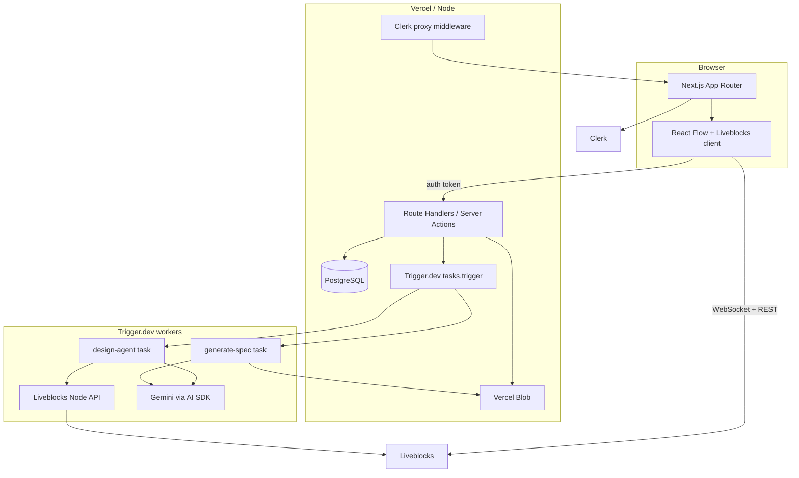

# Ghost Agentic AI

**Ghost Agentic AI** is a real-time collaborative workspace for system architecture. Teams describe systems in natural language, map them onto a shared canvas with AI assistance, refine the design together, and export a persisted Markdown technical specification from the resulting graph.

The product combines **Next.js**, **Clerk** authentication, **Liveblocks** and **React Flow** for multiplayer canvases, **Trigger.dev** for durable AI jobs, **Google Gemini** (via the Vercel AI SDK), **Prisma** with **PostgreSQL**, and **Vercel Blob** for canvas snapshots and generated specs.

---

## Table of contents

- [Ghost Agentic AI](#ghost-agentic-ai)
  - [Table of contents](#table-of-contents)
  - [Features](#features)
  - [Architecture overview](#architecture-overview)
  - [Prerequisites](#prerequisites)
  - [Getting started](#getting-started)
    - [1. Clone and install](#1-clone-and-install)
    - [2. Configure environment](#2-configure-environment)
    - [3. Run migrations](#3-run-migrations)
    - [4. Start the app](#4-start-the-app)
    - [5. (Optional) Run Trigger.dev locally](#5-optional-run-triggerdev-locally)
  - [Environment variables](#environment-variables)
    - [Application and database](#application-and-database)
    - [Clerk](#clerk)
    - [Liveblocks](#liveblocks)
    - [Google Gemini (AI SDK)](#google-gemini-ai-sdk)
    - [Trigger.dev](#triggerdev)
    - [Vercel Blob](#vercel-blob)
  - [Database and Prisma](#database-and-prisma)
  - [Background jobs (Trigger.dev)](#background-jobs-triggerdev)
  - [Scripts](#scripts)
  - [Project structure](#project-structure)
  - [API surface](#api-surface)
  - [Deployment notes](#deployment-notes)
  - [Development resources](#development-resources)
  - [License](#license)

---

## Features

| Area | What you get |
|------|----------------|
| **Authentication** | Sign-in / sign-up with Clerk; routes protected via Next.js proxy middleware (`src/proxy.ts`). |
| **Projects** | Create projects, manage ownership, invite collaborators by email, open a per-project workspace. |
| **Collaborative canvas** | Shared React Flow diagram backed by Liveblocks storage (`flow`: nodes and edges), live cursors, presence, and undo/redo. |
| **Canvas persistence** | Debounced autosave of `{ nodes, edges }` JSON to Vercel Blob; hydration on load when the room is empty. |
| **Starter templates** | Import curated system-design patterns (monolith, microservices, event-driven, etc.) into the active room. |
| **AI design agent** | Natural-language prompts drive a Trigger.dev task that mutates the shared canvas using Gemini and structured actions. |
| **Spec generation** | Background generation of Markdown specs from the graph; stored in Blob and recorded in the database with download support. |

Product goals, scope, and success criteria are summarized in [`src/prompts/project-overview.md`](src/prompts/project-overview.md).

---

## Architecture overview



- **Room ID** aligns with **project ID** for the workspace so authorization can tie Liveblocks rooms to `Project` rows.
- **AI runs** are tracked in `TaskRun` so the app can mint scoped public tokens for the client to subscribe to run progress (see [`src/app/api/ai/design/route.ts`](src/app/api/ai/design/route.ts)).

---

## Prerequisites

- **Node.js** 20+ (recommended; matches typical Next.js 16 and Prisma 7 setups).
- **npm** (this repo uses `package-lock.json`; `pnpm` / `yarn` work if you prefer—adjust commands accordingly).
- **PostgreSQL** database reachable via `DATABASE_URL`.
- Accounts / keys for: **Clerk**, **Liveblocks**, **Google AI Studio** (Gemini API key), **Trigger.dev**, and **Vercel Blob** (for uploads/downloads in non-Vercel environments you still need a Blob token).

---

## Getting started

### 1. Clone and install

```bash
git clone https://github.com/gift56/ghost-agentic-ai.git
cd ghost-agentic-ai
npm install
```

`postinstall` runs **`prisma generate`**, which emits the Prisma client into `src/generated/prisma`.

### 2. Configure environment

Copy your team’s env template or create **`.env.local`** in the project root (Next.js loads it for `next dev` / `next build`). See [Environment variables](#environment-variables) for the full list.

`prisma.config.ts` loads **`.env`** first, then **`.env.local`** with override—keep database URLs consistent across both if you use `.env` for Prisma CLI only.

### 3. Run migrations

```bash
npx prisma migrate deploy
# or during active development:
npx prisma migrate dev
```

### 4. Start the app

```bash
npm run dev
```

Open [http://localhost:3000](http://localhost:3000). Signed-in users are sent to **`/editor`**; guests are redirected to **`/sign-in`**.

### 5. (Optional) Run Trigger.dev locally

For AI design and spec tasks to execute in development:

```bash
npm run dev:trigger
```

Run this alongside `npm run dev` once `TRIGGER_PROJECT_REF` and Trigger authentication are configured for the [Trigger.dev CLI](https://trigger.dev/docs).

---

## Environment variables

Create **`.env.local`** (and optionally **`.env`** for Prisma-only tools). Values below marked **required** are necessary for a fully functional stack; others may have safe defaults or apply only to certain flows.

### Application and database

| Variable | Required | Purpose |
|----------|----------|---------|
| `DATABASE_URL` | **Yes** | PostgreSQL connection string for Prisma (`prisma.config.ts`, `src/lib/prisma.ts`). |

### Clerk


| Variable | Required | Purpose |
|----------|----------|---------|
| `NEXT_PUBLIC_CLERK_PUBLISHABLE_KEY` | **Yes** | Clerk publishable key (browser). |
| `CLERK_SECRET_KEY` | **Yes** | Clerk secret key (server). |
| `NEXT_PUBLIC_CLERK_SIGN_IN_URL` | No | Defaults used in code: `/sign-in`. |
| `NEXT_PUBLIC_CLERK_SIGN_UP_URL` | No | Defaults used in code: `/sign-up`. |

### Liveblocks

| Variable | Required | Purpose |
|----------|----------|---------|
| `LIVEBLOCKS_SECRET_KEY` | **Yes** | Server-side Liveblocks client (`src/lib/liveblocks.ts`, design-agent task) and `/api/liveblocks-auth`. |

The browser uses **`LiveblocksProvider`** with **`authEndpoint: "/api/liveblocks-auth"`**—no public Liveblocks key is required in env for that pattern.

### Google Gemini (AI SDK)

| Variable | Required | Purpose |
|----------|----------|---------|
| `GEMINI_API_KEY` | **Yes** for AI | Used by Trigger tasks for design and spec generation (`src/trigger/design-agent.ts`, `src/trigger/generate-spec.ts`). |

### Trigger.dev

| Variable | Required | Purpose |
|----------|----------|---------|
| `TRIGGER_PROJECT_REF` | **Yes** for tasks | Project reference in `trigger.config.ts`. |
| Trigger CLI auth | **Yes** for `dev:trigger` / deploy | Follow Trigger.dev docs for logging in (e.g. `TRIGGER_ACCESS_TOKEN` or interactive `trigger login`). Server-side `tasks.trigger` / `createPublicToken` expect the SDK to be configured per Trigger.dev’s Next.js integration. |

### Vercel Blob

| Variable | Required | Purpose |
|----------|----------|---------|
| `BLOB_READ_WRITE_TOKEN` | **Yes** for persistence | Used implicitly by `@vercel/blob` for canvas JSON and Markdown spec uploads (`src/app/api/projects/[projectId]/canvas/route.ts`, triggers, downloads). On Vercel, linking Blob often injects this; locally, create a token in the Vercel dashboard. |

---

## Database and Prisma

- **ORM**: Prisma 7 with the **PostgreSQL** provider and client output at **`src/generated/prisma`**.
- **Adapter**: `@prisma/adapter-pg` with `pg` in `src/lib/prisma.ts` for serverless-friendly connections.
- **Migrations** live under **`prisma/migrations/`**. Main models (from migrations):

  - **`Project`** — metadata, `canvasJsonPath` (Blob URL for last saved graph JSON).
  - **`ProjectCollaborator`** — email-based sharing.
  - **`TaskRun`** — maps Trigger `runId` to `projectId` and `userId` for scoped realtime tokens.
  - **`ProjectSpec`** — links generated spec files (Blob paths) to projects.

Useful commands:

```bash
npx prisma migrate dev      # create/apply migrations in development
npx prisma migrate deploy   # apply in CI/staging/production
npx prisma studio           # browse data
```

---

## Background jobs (Trigger.dev)

- **Config**: [`trigger.config.ts`](trigger.config.ts) — `project: process.env.TRIGGER_PROJECT_REF`, tasks in **`src/trigger/`**, **Prisma** build extension enabled.
- **Tasks**:
  - **`design-agent`** — reads/writes the Liveblocks room via `@liveblocks/node` and `@liveblocks/react-flow/node`, calls Gemini with structured output, broadcasts status/events to the room.
  - **`generate-spec`** — builds Markdown from the graph and uploads via `put` to Vercel Blob.

**Local workflow**: terminal 1 → `npm run dev`; terminal 2 → `npm run dev:trigger`.

**Deploy**: `npm run deploy:trigger` (ensure secrets in the Trigger.dev project match production env).

---

## Scripts

| Command | Description |
|---------|-------------|
| `npm run dev` | Next.js development server (Turbopack by default in Next 16). |
| `npm run build` | Production build (runs TypeScript check). |
| `npm run start` | Start production server after `build`. |
| `npm run lint` | ESLint (Next.js config). |
| `npm run dev:trigger` | Trigger.dev local worker against `src/trigger`. |
| `npm run deploy:trigger` | Deploy Trigger tasks to Trigger.dev cloud. |
| `postinstall` | `prisma generate` |

---

## Project structure

| Path | Role |
|------|------|
| [`src/app/`](src/app/) | App Router pages and route handlers (`page.tsx`, `layout.tsx`, `api/**/route.ts`). |
| [`src/components/editor/`](src/components/editor/) | Editor shell, navbar, canvas, AI sidebar, workspace room (`LiveblocksProvider` / `RoomProvider`). |
| [`src/lib/`](src/lib/) | Prisma singleton, Liveblocks server client, project access helpers, data loaders. |
| [`src/trigger/`](src/trigger/) | Trigger.dev task definitions (`design-agent`, `generate-spec`). |
| [`src/types/`](src/types/) | Shared TypeScript types (canvas, tasks, etc.). |
| [`prisma/`](prisma/) | `schema.prisma`, SQL migrations. |
| [`src/proxy.ts`](src/proxy.ts) | Clerk **`clerkMiddleware`** — shown in production build as **ƒ Proxy (Middleware)** for global auth gating. |
| [`src/prompts/`](src/prompts/) | Product and feature specs used as internal context for development. |

---

## API surface

High-level map of **`src/app/api`** routes:

| Method / path | Role |
|---------------|------|
| `POST /api/liveblocks-auth` | Issues Liveblocks session for the current Clerk user and authorized room. |
| `POST /api/liveblocks-resolve-users` | Resolves Clerk user IDs to display names/avatars for Liveblocks UI. |
| `GET/POST /api/projects` | List/create projects. |
| `GET/PATCH/DELETE /api/projects/[projectId]` | Project CRUD and cleanup (including Blob deletion where applicable). |
| `GET/PUT /api/projects/[projectId]/canvas` | Load/save canvas JSON snapshot (Blob-backed). |
| `GET/POST /api/projects/[projectId]/collaborators` | Collaborator listing and invites. |
| `GET/POST /api/projects/[projectId]/specs` | Spec listing and generation triggers. |
| `GET /api/projects/[projectId]/specs/[specId]/download` | Download spec content from Blob. |
| `POST /api/ai/design` (+ `/api/ai/design/token`) | Start design-agent run and token for client subscriptions. |
| `POST /api/ai/spec` (+ `/api/ai/spec/token`) | Spec generation and run token pattern analogous to design. |

All project-scoped routes enforce **Clerk authentication** and **project access** (owner or collaborator) via shared helpers in `src/lib/project-access.ts`.

---

## Deployment notes

- **Vercel** (or similar): set all [environment variables](#environment-variables); connect **Postgres**; enable **Blob**; deploy Trigger tasks and configure the same secrets on Trigger.dev.
- **Build**: `npm run build` must succeed with `DATABASE_URL` available if any build step touches the DB (Prisma generate does not require DB; migrations are separate).
- **Metadata**: [`src/app/layout.tsx`](src/app/layout.tsx) sets `metadataBase` to `http://localhost:3000` — update for your production domain to fix Open Graph and canonical URLs.

---

## Development resources

- **Internal product doc**: [`src/prompts/project-overview.md`](src/prompts/project-overview.md)
- **Next.js**: [https://nextjs.org/docs](https://nextjs.org/docs)
- **Clerk + Next.js**: [https://clerk.com/docs/quickstarts/nextjs](https://clerk.com/docs/quickstarts/nextjs)
- **Liveblocks + React Flow**: [https://liveblocks.io/docs](https://liveblocks.io/docs)
- **Trigger.dev**: [https://trigger.dev/docs](https://trigger.dev/docs)
- **Prisma 7**: [https://www.prisma.io/docs](https://www.prisma.io/docs)
- **Vercel Blob**: [https://vercel.com/docs/storage/vercel-blob](https://vercel.com/docs/storage/vercel-blob)

---

## License

This repository is **private** (`"private": true` in `package.json`). Add a `LICENSE` file if you open-source the project.
